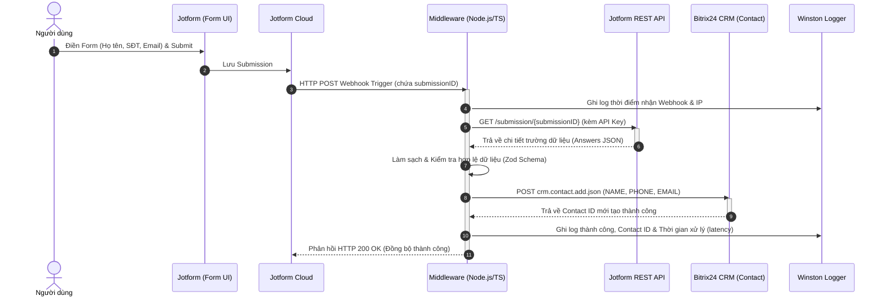
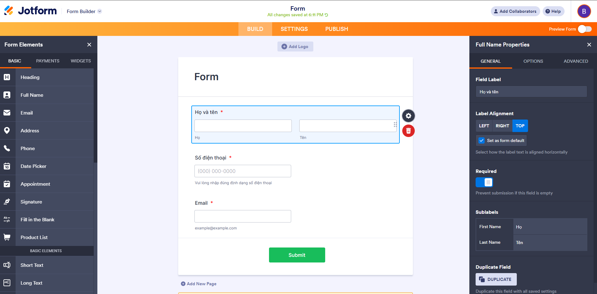
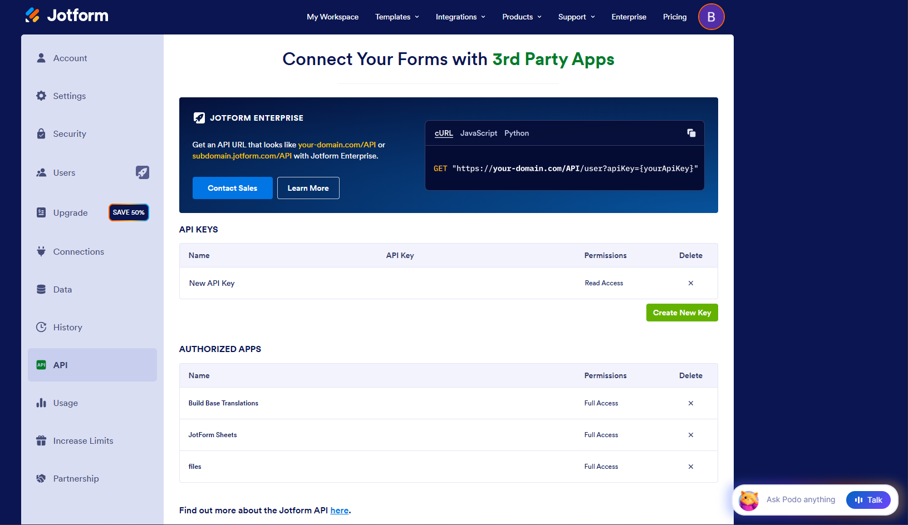
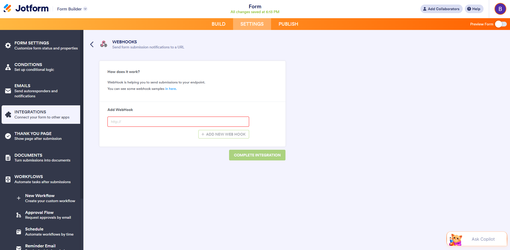
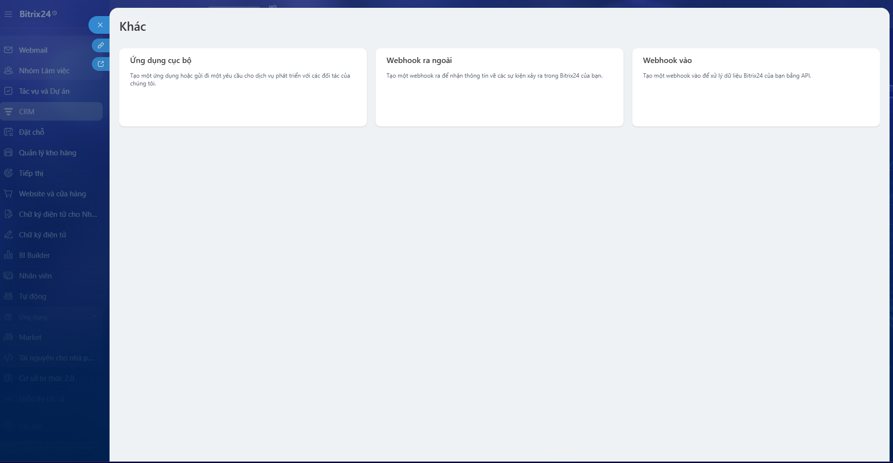

# Tích Hợp Jotform Với Bitrix24 CRM (Module Contact)

[](https://nodejs.org/)
[](https://www.typescriptlang.org/)
[](https://expressjs.com/)

> Ứng dụng Middleware kết nối tự động giữa biểu mẫu **Jotform** và **Bitrix24 CRM (Module Contact)**. Khi người dùng nộp biểu mẫu trên Jotform, ứng dụng tiếp nhận webhook, gọi Jotform API lấy thông tin chi tiết, chuẩn hóa dữ liệu và tự động tạo mới bản ghi Contact trên Bitrix24 CRM theo thời gian thực.

---

## 1. Tech Stack

- **Runtime & Language**: Node.js (v18+) & TypeScript (v5.x)
- **Web Framework**: Express.js
- **Data Validation & Sanitization**: Zod
- **Logging**: Winston Logger
- **HTTP Client**: Axios
- **Form Parsing**: Multer + Body-parser (hỗ trợ multipart/form-data, json, urlencoded)

---

## 2. Sơ đồ Luồng Hoạt Động (Data Flow)



### Ánh Xạ Dữ Liệu (Field Mapping)

| Trường Jotform | Kiểu trường | Trường DTO (`ContactData`) | Trường Bitrix24 CRM | Định dạng Payload Bitrix24 |
| :--- | :--- | :--- | :--- | :--- |
| **Họ và tên** | Full Name / Text | `fullName` | `NAME` | `"NAME": "Nguyễn Văn A"` |
| **Số điện thoại** | Phone Field | `phone` | `PHONE` | `"PHONE": [{"VALUE": "0912345678", "VALUE_TYPE": "WORK"}]` |
| **Email** | Email Field | `email` | `EMAIL` | `"EMAIL": [{"VALUE": "user@example.com", "VALUE_TYPE": "WORK"}]` |
| **Metadata** | `submissionID` | `submissionId`, `formId` | `COMMENTS` | Lưu vết Submission ID & Form ID để đối soát |

---

## 3. Hướng Dẫn Thiết Lập Nền Tảng

### A. Thiết lập tài khoản Jotform và lấy API Key
1. **Đăng ký / Đăng nhập**: Truy cập [Jotform](https://www.jotform.com/) theo tài khoản của bạn.
2. **Tạo Form**:
   * Tạo biểu mẫu với **3 trường bắt buộc**: **Họ và tên** (Full Name), **Số điện thoại** (Phone), **Email** (Email).
   * Đặt thuộc tính `Required = Yes` cho cả 3 trường.



3. **Lấy API Key**:
   * Vào **Avatar góc phải** $\rightarrow$ **Settings** $\rightarrow$ chọn tab **API** (hoặc truy cập `https://www.jotform.com/myaccount/api`).
   * Bấm **Create New Key** $\rightarrow$ Đặt tên và chọn quyền **Full Access** $\rightarrow$ Copy API Key để dán vào file `.env`.



4. **Cài đặt Webhook cho Form**:
   * Tại giao diện sửa Form $\rightarrow$ **Settings** $\rightarrow$ **Integrations** $\rightarrow$ tìm **Webhooks**.
   * Dán URL Webhook của server: `https://<your-domain-or-ngrok>/webhook/jotform`.
   * Bấm **Complete Integration**.



---

### B. Thiết lập Inbound Webhook trên Bitrix24 và lấy Webhook URL
1. Đăng nhập vào cổng Bitrix24 của bạn.
2. Điều hướng tới: **Ứng dụng (Applications)** $\rightarrow$ **Tài nguyên cho nhà phát triển (Developer resources)** $\rightarrow$ **Khác (Other)** $\rightarrow$ Chọn **Webhook vào (Inbound webhook)**.



3. Tại mục **Các quyền truy cập (Permissions)**: Tích chọn quyền **`CRM`** (*Quản trị quan hệ khách hàng*).
4. Bấm **Lưu (Save)**.
5. Sao chép đường dẫn tại ô **"Webhook để gọi REST API"** và dán vào biến `BITRIX24_WEBHOOK_URL` trong file `.env`.

---

## 4. Hướng Dẫn Cài Đặt & Chạy Ứng Dụng

### Bước 1: Yêu cầu môi trường
- **Node.js**: Phiên bản 18 trở lên
- **npm**: Phiên bản 9 trở lên

### Bước 2: Cài đặt thư viện
```bash
cd 01-api-jotform-bitrix24
npm install
```

### Bước 3: Cấu hình biến môi trường (`.env`)
Tạo file `.env` từ file mẫu:
```bash
cp .env.example .env
```

Cập nhật các biến trong file `.env`:
```env
PORT=3000
NODE_ENV=development

# Webhook URL từ Bitrix24 (kèm token)
BITRIX24_WEBHOOK_URL=your_bitrix24_webhook_url_here

# Thông tin API Jotform
JOTFORM_FORM_ID=your_jotform_form_id_here
JOTFORM_API_KEY=your_jotform_api_key_here
JOTFORM_API_BASE_URL=https://api.jotform.com

# Logging
LOG_LEVEL=info
LOG_DIR=logs
```

### Bước 4: Khởi chạy ứng dụng

**Chế độ phát triển (Development):**
```bash
npm run dev
```

**Chế độ Production:**
```bash
npm run build
npm start
```

**Mở cổng Public qua Ngrok (để nhận webhook từ Jotform):**
```bash
ngrok http 3000
```
> Copy link HTTPS (ví dụ: `https://xxxx.ngrok-free.app/webhook/jotform`) và cấu hình vào Webhook của Jotform.

---

## 5. Hướng Dẫn Kiểm Thử (Testing)

### Cách 1: Chạy bộ test tích hợp tự động
```bash
npm test
```
*Bộ test sẽ kiểm tra: tính hợp lệ của Validator Zod, kết nối Jotform API qua API Key và tạo một Contact mẫu trực tiếp trên Bitrix24 CRM.*

### Cách 2: Nộp form thực tế trên giao diện Jotform (Bắt buộc chạy kèm Ngrok)

> [!IMPORTANT]
> Do server chạy ở máy cục bộ (`localhost:3000`), máy chủ Jotform Cloud **không thể kết nối trực tiếp đến localhost**. Do đó, **bắt buộc phải bật Ngrok** để chuyển tiếp webhook công khai từ Internet về máy của bạn:

1. **Mở terminal 1 - Chạy server:**
   ```bash
   npm run dev
   ```
2. **Mở terminal 2 - Chạy Ngrok:**
   ```bash
   ngrok http 3000
   ```
3. **Cập nhật Webhook URL trên Form Jotform:**
   - Copy link HTTPS từ ngrok (dạng `https://xxxx.ngrok-free.app/webhook/jotform`).
   - Vào Jotform $\rightarrow$ **Settings** $\rightarrow$ **Integrations** $\rightarrow$ **Webhooks** $\rightarrow$ Cập nhật URL này.
4. **Điền và nộp form:**
   - Mở link Form Jotform, nhập đầy đủ Họ và tên, Số điện thoại, Email $\rightarrow$ Bấm **Submit**.
5. **Kiểm tra kết quả:**
   - Mở **Bitrix24 CRM $\rightarrow$ Menu Liên hệ (Contacts)**: Bản ghi Contact mới sẽ xuất hiện ngay lập tức kèm thông tin và audit comment.
   - Kiểm tra log chi tiết tại terminal hoặc file `logs/combined.log`.

---

## 6. Cơ Chế Xử Lý Lỗi (Error Handling)

Ứng dụng được thiết kế với cơ chế xử lý lỗi đa tầng, đảm bảo tính ổn định và toàn vẹn dữ liệu:

1. **Xác thực cấu hình (Startup Validation)**:
   - Kiểm tra bắt buộc các biến môi trường (`BITRIX24_WEBHOOK_URL`, `JOTFORM_API_KEY`) ngay khi khởi động (`validateConfig()`), dừng tiến trình nếu thiếu để tránh lỗi runtime.
2. **Kiểm tra kết nối & Timeout**:
   - Thiết lập Timeout (10 giây) cho các kết nối Axios đến Jotform và Bitrix24 API, xử lý bắt lỗi mạng và ngắt kết nối kịp thời.
   - Xử lý các mã lỗi xác thực từ bên thứ ba (`401 Unauthorized`, `ACCESS_DENIED`, token hết hạn/sai quyền).
3. **Định dạng & Làm sạch dữ liệu (Zod Schema)**:
   - Kiểm tra nghiêm ngặt 3 trường bắt buộc: `fullName` không được rỗng, `phone` được chuẩn hóa regex (lọc ký tự lạ, tối thiểu 5 số), `email` chuẩn RFC và chuyển thành chữ thường.
4. **Cơ chế dự phòng (Fallback Parsing)**:
   - Nếu yêu cầu lấy dữ liệu từ Jotform REST API gặp sự cố (quá giới hạn rate limit hoặc gián đoạn mạng), hệ thống tự động kích hoạt bộ parser dự phòng để bóc tách trực tiếp từ payload webhook (`rawRequest`/`pretty`).
5. **Logging & Phản hồi HTTP**:
   - Mọi lỗi phát sinh đều được ghi nhận chi tiết kèm stack trace vào `logs/error.log`.
   - Phản hồi mã HTTP phù hợp (200 khi thành công, 400 kèm message chi tiết khi dữ liệu không hợp lệ) giúp Jotform không gửi lặp lại webhook không cần thiết.
