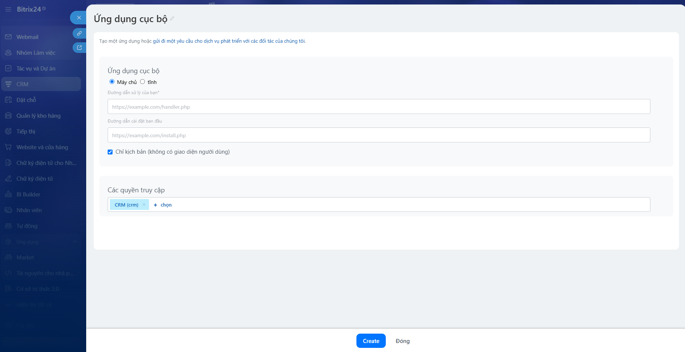
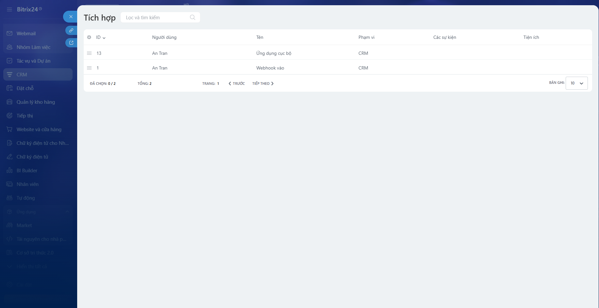
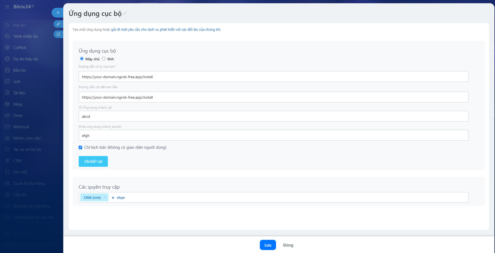
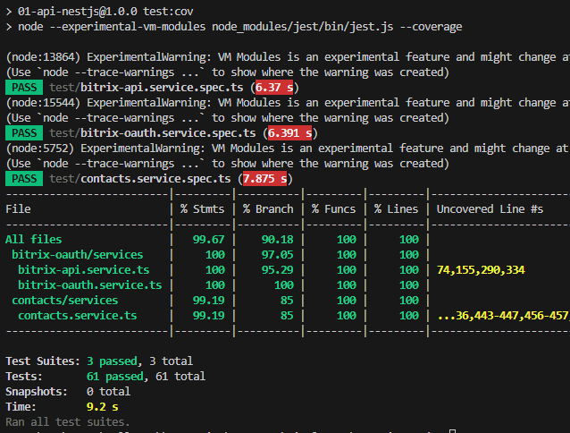
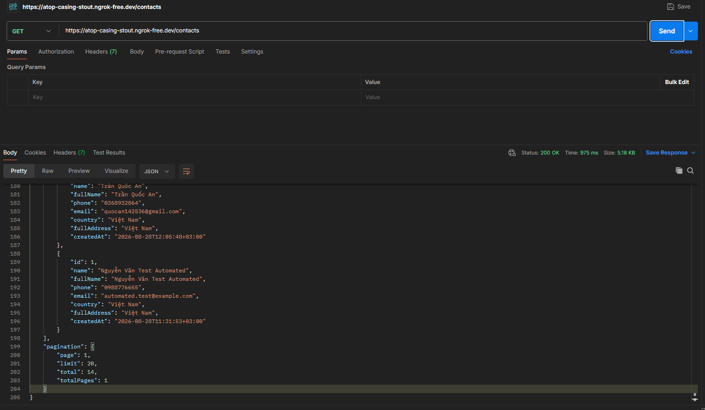
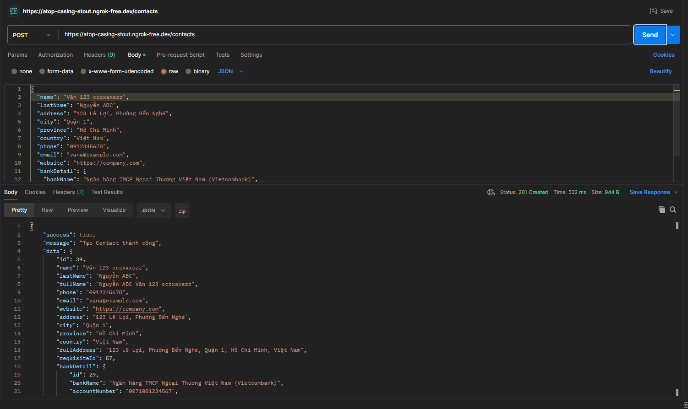
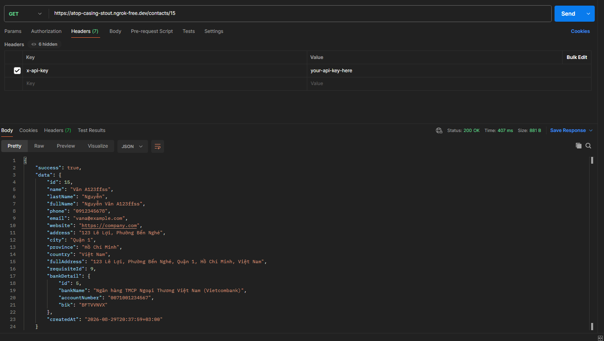
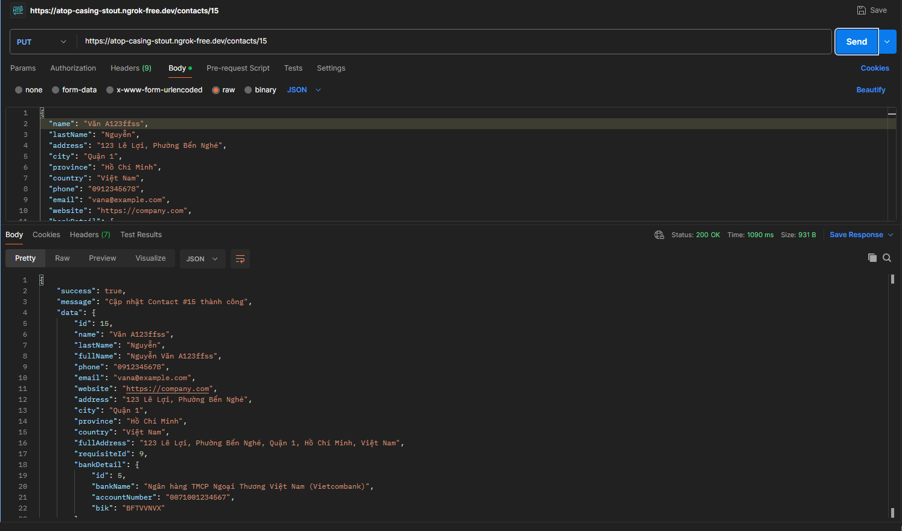
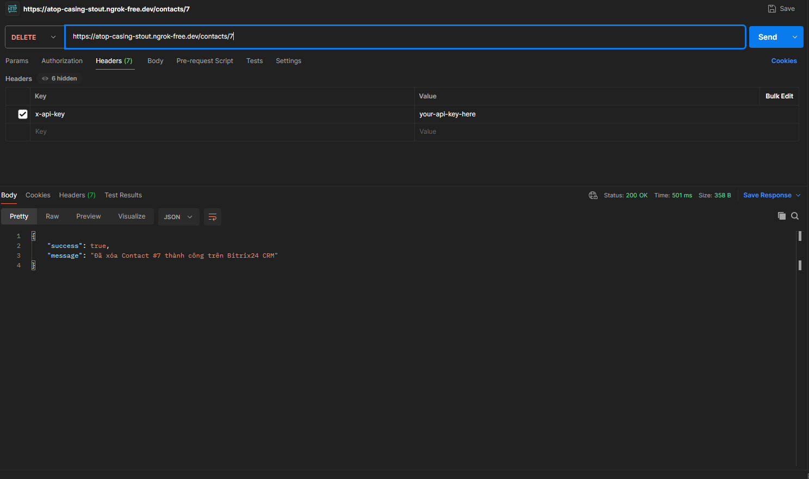

# Bitrix24 CRM REST API Integration Gateway (NestJS v12)

> Ứng dụng Backend NestJS tích hợp Bitrix24 REST API qua OAuth 2.0 Local Application, hỗ trợ quản lý Contact và Thông tin Ngân hàng (Requisites & Bank Details) 3 tầng.

---

## 🌟 Tính Năng Nổi Bật

1. **OAuth 2.0 & Token Lifecycle:** Nhận sự kiện cài đặt tại `/install`, lưu trữ Token an toàn vào SQLite qua TypeORM. Tự động kiểm tra thời hạn và làm mới Token (Reactive 401 Auto-Refresh & Retry).
2. **Quản lý Contact & Requisites 3 Tầng Chuẩn Bitrix24:** 
   ```mermaid
   graph LR
       A["Contact (ID)"] -->|"ENTITY_TYPE_ID = 3"| B["Requisite (ID)"]
       B -->|"ENTITY_ID = Requisite ID"| C["Bank Detail"]
   ```
3. **Bitrix24 Batch API Engine (`/rest/batch.json`):** Tối ưu hóa toàn bộ các luồng `create`, `findOne`, `update` bằng cách gom nhiều lệnh vào **1 HTTP request duy nhất**, hỗ trợ tham chiếu động (`$result[cmd_name]`), giúp tối ưu hóa tối đa độ trễ mạng và tiết kiệm hạn ngạch gọi API của Bitrix24.
4. **Tối Ưu Hiệu Năng (Giải quyết N+1 Query):** Sử dụng Batch Fetching Requisites (`@ENTITY_ID`) và Bank Details trong `findAll()` để lấy toàn bộ danh sách liên hệ chỉ qua vài lượt gọi gom nhóm thay vì gọi lặp từng bản ghi.
5. **Bảo Mật & Chuẩn Hóa:** Xác thực qua Header `x-api-key`, DTO validation nghiêm ngặt (`class-validator`), Exception Filter chuẩn hóa cấu trúc lỗi JSON toàn cục.
6. **Tài Liệu Tự Động:** Swagger UI tích hợp sẵn tại `/docs`.

---

## 🛠️ Công Nghệ Sử Dụng (Tech Stack) & Yêu Cầu Môi Trường

| Thành Phần | Công Nghệ / Thư Viện | Phiên Bản | Ghi Chú |
| :--- | :--- | :---: | :--- |
| **Runtime** | **Node.js** | **v20.19+ / v22.12+** | Tối thiểu **v20.19+** hoặc **v22.12+** (hỗ trợ `require(esm)` cho NestJS 12); khuyến nghị **v22.22+** để tương thích tối đa Nest CLI & Jest ESM. |
| **Framework** | **NestJS (Latest)** | **v12.0.1** | Kiến trúc module hóa Clean Architecture, Dependency Injection. |
| **Language** | **TypeScript** | **v5.7.3** | Strict type-safety, Decorator metadata. |
| **Database & ORM** | **TypeORM + SQLite** | **v0.3.20** | Lưu trữ Token OAuth gọn nhẹ, không cần cài đặt SQL Server ngoài. |
| **HTTP Client** | **Axios + @nestjs/axios** | **v1.7.9 / v12.0.0** | Giao tiếp REST API & Batch JSON với Bitrix24. |
| **Validation** | **class-validator / transformer** | **v0.14.1** | Xác thực DTO payload chặt chẽ. |
| **Logging** | **Winston (nest-winston)** | **v3.17.0** | Ghi log hệ thống ra cả Console và file log xoay vòng. |
| **Tài Liệu API** | **Swagger UI / OpenAPI** | **v12.0.1** | Tự động sinh tài liệu tương tác tại `/docs`. |
| **Testing** | **Jest + @nestjs/testing** | **v29.7.0** | Unit Test. |

---

## 🏗️ Cấu Trúc Dự Án

```
01-api-nestjs/
├── src/
│   ├── main.ts                     # Bootstrap: Swagger (/docs), ValidationPipe, Winston Logger, Filter
│   ├── common/                     # Guards (x-api-key), Filters (HttpException), Constants (Bitrix Methods)
│   ├── configs/                    # Quản lý biến môi trường (.env) và Fallback mặc định
│   ├── databases/                  # Cấu hình TypeORM & SQLite (data/tokens.sqlite)
│   ├── modules/
│   │   ├── bitrix-oauth/           # BÀI 1: OAuth Controller (/install), Service, Token Entity
│   │   └── contacts/               # BÀI 2: Contact Controller (/contacts), Service, DTOs
│   └── loggers/                    # Winston Logger (Console màu + File logs)
├── test/                           # Unit Tests với @nestjs/testing & Jest
├── docs/images/                    # Ảnh minh họa kết quả Unit Test & Postman Demo
└── data/                           # SQLite Database lưu trữ Token
```

---

## 🚀 Hướng Dẫn Cài Đặt & Chạy Nhanh

### 1. Cài đặt dependencies
```bash
npm install --legacy-peer-deps
```

### 2. Cấu hình file `.env`
Tạo file `.env` từ `.env.example`:
```env
PORT=3000
API_KEY=aasc_technical_test_secret_key_2026
BITRIX24_CLIENT_ID=local.xxxxxxxxxxxxxxxxxxxxxxxx
BITRIX24_CLIENT_SECRET=xxxxxxxxxxxxxxxxxxxxxxxxxxxxxxxxxxxxxxxx
BITRIX24_OAUTH_URL=https://oauth.bitrix.info/oauth/token/
DATABASE_PATH=data/tokens.sqlite
```

### 3. Khởi chạy Server
```bash
# Chế độ phát triển (Development):
npm run start:dev

# Kiểm tra tài liệu Swagger UI tương tác:
http://localhost:3000/docs
```

---

## 🌐 Hướng Dẫn Cấu Hình ngrok & Bitrix24 Local App

### 1. Cấu hình ngrok tạo Tunnel công khai
* Nếu chưa cài đặt ngrok, truy cập trang chủ [https://ngrok.com/download](https://ngrok.com/download) để tải và cài đặt.
* Mở terminal và khởi chạy lệnh tạo tunnel tới đúng port server backend đang chạy (mặc định là port `3000`):
  ```bash
  ngrok http 3000
  ```
* Sao chép đường dẫn **HTTPS** công khai do ngrok cung cấp (Ví dụ: `https://your-domain.ngrok-free.app`).

---

### 2. Cấu hình Local Application trên Bitrix24

#### Bước 1: Điều hướng tới mục Tạo Ứng dụng cục bộ
* Truy cập portal Bitrix24 $\rightarrow$ Menu bên trái chọn **Dành cho nhà phát triển (Developer resources)** $\rightarrow$ **Khác (Other)** $\rightarrow$ Chọn **Ứng dụng cục bộ (Local Application)**.


#### Bước 2: Điền thông tin tạo Ứng dụng cục bộ
* Loại ứng dụng: Tích chọn **Chỉ kịch bản (Không có giao diện người dùng)** *(Server / Script only)*.
* Điền đường dẫn webhook ngrok vào **cả 2 vị trí bắt buộc**:
  * **Đường dẫn trình xử lý ban đầu (Handler URL):** `https://your-domain.ngrok-free.app/install`
  * **Đường dẫn cài đặt (Installation URL):** `https://your-domain.ngrok-free.app/install`
* **Phạm vi quyền truy cập (Scope):** Tích chọn **CRM (`crm`)**.
* Bấm **Tạo (Create)**.



#### Bước 3: Lấy Mã ứng dụng (Client ID) & Khóa ứng dụng (Client Secret)
* Sau khi lưu, truy cập tab **Tích hợp (Integrations)** trong mục Dành cho nhà phát triển.
* Click vào biểu tượng **3 dấu gạch (menu tùy chọn)** của Ứng dụng cục bộ vừa tạo $\rightarrow$ Click **Sửa (Edit)**.



* Trong màn hình chỉnh sửa ứng dụng:
  * Sao chép **Mã ứng dụng (Application ID)** $\rightarrow$ Dán vào biến `BITRIX24_CLIENT_ID` trong file `.env`.
  * Sao chép **Khóa ứng dụng (Application Key)** $\rightarrow$ Dán vào biến `BITRIX24_CLIENT_SECRET` trong file `.env`.
  * Click vào nút **CÀI ĐẶT LẠI (REINSTALL)** ở góc dưới cùng của màn hình cập nhật ứng dụng.



#### Bước 4: Hoàn tất kích hoạt Token
* Khi click nút **CÀI ĐẶT LẠI**, Bitrix24 sẽ lập tức gửi một POST request tới webhook `https://your-domain.ngrok-free.app/install`.
* Backend NestJS tự động bắt sự kiện cài đặt, thực hiện security handshake (xác thực scope quyền CRM) và lưu cặp Token vào SQLite (`data/tokens.sqlite`).

---

## 📡 Danh Sách RESTful API & Cách Sử Dụng

> 🔒 **Xác thực API Key:** Tất cả các endpoint `/contacts` đều yêu cầu header bảo mật `x-api-key`. Vui lòng thay thế giá trị mẫu `aasc_technical_test_secret_key_2026` trong các ví dụ bên dưới bằng giá trị `API_KEY` tương ứng trong file `.env` của bạn.

| Method | Endpoint | Mô Tả | Authentication |
| :--- | :--- | :--- | :---: |
| `POST` | `/install` | Nhận sự kiện cài đặt OAuth từ Bitrix24 | Public |
| `GET` | `/contacts` | Lấy danh sách Contact có phân trang (`?page=1&limit=20`) | `x-api-key` |
| `POST` | `/contacts` | Thêm mới Contact kèm thông tin ngân hàng | `x-api-key` |
| `GET` | `/contacts/:id` | Xem chi tiết 1 Contact theo ID | `x-api-key` |
| `PUT` | `/contacts/:id` | Cập nhật Contact & thông tin ngân hàng | `x-api-key` |
| `DELETE` | `/contacts/:id` | Xóa Contact kèm Requisite & Bank Detail liên kết | `x-api-key` |
| `GET` | `/docs` | Giao diện tài liệu tương tác Swagger UI | Public |

### 💻 Hướng Dẫn Sử Dụng API Qua cURL (Đầy Đủ Các Endpoint):
*(Lưu ý: Thay `aasc_technical_test_secret_key_2026` bằng giá trị `API_KEY` trong file `.env` và thay `142` bằng ID thực tế của Contact trên Bitrix24 portal của bạn)*

#### 1. Nhận sự kiện cài đặt OAuth (`POST /install`)
```bash
curl -X POST "http://localhost:3000/install" \
     -H "Content-Type: application/json" \
     -d '{
       "event": "ONAPPINSTALL",
       "auth": {
         "access_token": "your_access_token_from_bitrix",
         "refresh_token": "your_refresh_token_from_bitrix",
         "domain": "your_portal.bitrix24.vn",
         "expires_in": 3600,
         "member_id": "member_xyz_123"
       }
     }'
```

#### 2. Lấy danh sách Contact có phân trang (`GET /contacts`)
```bash
curl -X GET "http://localhost:3000/contacts?page=1&limit=10" \
     -H "x-api-key: aasc_technical_test_secret_key_2026"
```

#### 3. Thêm mới Contact kèm thông tin ngân hàng (`POST /contacts`)
```bash
curl -X POST "http://localhost:3000/contacts" \
     -H "Content-Type: application/json" \
     -H "x-api-key: aasc_technical_test_secret_key_2026" \
     -d '{
       "name": "Nguyễn Văn A",
       "lastName": "Nguyễn",
       "phone": "0912345678",
       "email": "vana@example.com",
       "website": "https://company.com",
       "address": "123 Lê Lợi",
       "city": "Quận 1",
       "province": "Hồ Chí Minh",
       "country": "Việt Nam",
       "bankDetail": {
         "bankName": "Vietcombank",
         "accountNumber": "0071001234567",
         "bik": "BFTVVNVX"
       }
     }'
```

#### 4. Xem chi tiết 1 Contact theo ID (`GET /contacts/:id`)
*(Thay `142` bằng ID của Contact thật trên Bitrix24)*
```bash
curl -X GET "http://localhost:3000/contacts/142" \
     -H "x-api-key: aasc_technical_test_secret_key_2026"
```

#### 5. Cập nhật thông tin Contact & ngân hàng (`PUT /contacts/:id`)
*(Thay `142` bằng ID của Contact thật cần cập nhật. Nếu muốn gỡ bỏ hoàn toàn thông tin ngân hàng, truyền `"bankDetail": null`)*
```bash
curl -X PUT "http://localhost:3000/contacts/142" \
     -H "Content-Type: application/json" \
     -H "x-api-key: aasc_technical_test_secret_key_2026" \
     -d '{
       "name": "Nguyễn Văn B",
       "phone": "0987654321",
       "bankDetail": {
         "bankName": "Techcombank",
         "accountNumber": "1903001234567"
       }
     }'
```

#### 6. Xóa Contact theo ID (`DELETE /contacts/:id`)
*(Thay `142` bằng ID của Contact thật cần xóa)*
```bash
curl -X DELETE "http://localhost:3000/contacts/142" \
     -H "x-api-key: aasc_technical_test_secret_key_2026"
```

---

## 🛡️ Các Lỗi Đã Xử Lý & Cách Kiểm Tra (Error Handling & Verification)

| Tình Huống | Mã Lỗi | Cơ Chế Xử Lý | Cách Kiểm Tra / Test |
| :--- | :---: | :--- | :--- |
| **Token hết hạn (1 giờ)** | `401` | Tự động làm mới Access Token qua OAuth server, cập nhật SQLite và gửi lại request thành công cho người dùng. | Sửa thủ công trường `expires_at` trong SQLite về quá khứ $\rightarrow$ gọi API `/contacts`, quan sát console tự động refresh token thành công. |
| **Truyền Token sai / giả tại `/install`** | `401` | `BitrixOAuthService` thực hiện Security Handshake (`app.info`) trực tiếp với Bitrix24 trước khi lưu. Nếu token không hợp lệ sẽ từ chối lưu vào DB. | Gửi `POST /install` với body `{"auth": {"access_token": "token_gia_123", ...}}` $\rightarrow$ nhận `401 Unauthorized` ("Xác thực Token với Bitrix24 thất bại"). |
| **Thiếu / Sai API Key** | `401` | `ApiKeyGuard` chặn request từ cổng vào, trả về JSON chuẩn hóa. | Gửi request không kèm header `x-api-key` hoặc kèm key sai $\rightarrow$ nhận `401 Unauthorized`. |
| **DTO không hợp lệ** | `400` | `ValidationPipe` chặn lỗi format Email, SĐT regex, thiếu tên bắt buộc. | Gửi request `POST /contacts` với body `{"name": "A", "email": "sai-format"}` $\rightarrow$ nhận `400 Bad Request`. |
| **Không tìm thấy Contact** | `404` | Bắt lỗi và phản hồi `"Contact #... không tồn tại"`. | Gửi request `GET /contacts/9999999` $\rightarrow$ nhận `404 Not Found`. |
| **Timeout API Bitrix24** | `504` | Timeout mặc định 10s, ghi log chi tiết vào file `logs/error.log`. | Ngắt kết nối mạng hoặc gọi tới portal không phản hồi quá 10s $\rightarrow$ nhận `504 Gateway Timeout`. |

---

## 🧪 Kết Quả Kiểm Thử (Unit Tests & Demo)

### 1. Kiểm Thử Đơn Vị (Unit Tests)
Toàn bộ service cốt lõi được kiểm thử với `@nestjs/testing` và Jest:
* **Test Suites:** 3 passed, 3 total
* **Tests:** **100% Passed**
* **Code Coverage:** Đạt độ phủ toàn diện trên toàn bộ các modules (`bitrix-oauth`, `bitrix-api`, `contacts`).
* **Linter & Build:** `npm run lint` (0 errors), `npm run build` (Success).

```bash
# Chạy Unit Tests:
npm test

# Chạy kiểm tra độ phủ Code Coverage:
npm run test:cov
```

### 2. Kết Quả Chạy Unit Test


### 3. Kết Quả Test Postman (Contact & Requisite)

#### 1. Lấy danh sách Contact có phân trang (`GET /contacts`)


#### 2. Thêm mới Contact kèm Requisite (`POST /contacts`)


#### 3. Xem chi tiết Contact kèm Requisite theo ID (`GET /contacts/:id`)


#### 4. Cập nhật Contact & Requisite (`PUT /contacts/:id`)


#### 5. Xóa Contact kèm Requisite theo ID (`DELETE /contacts/:id`)

