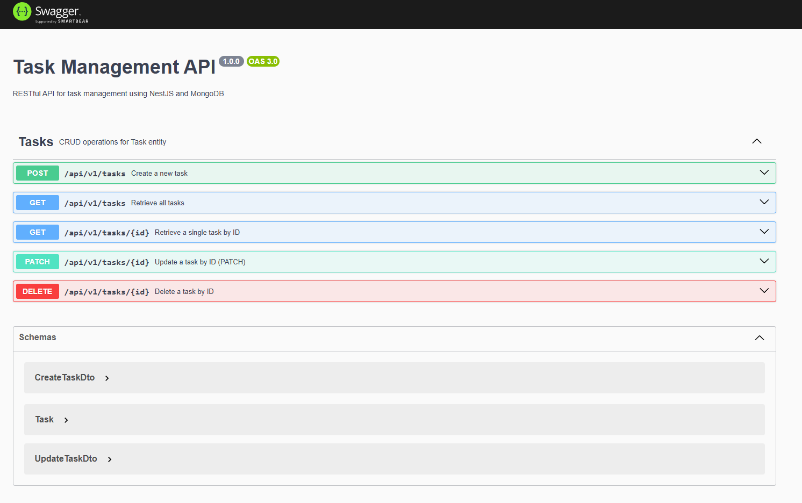
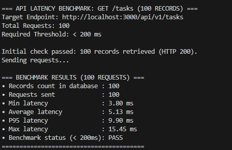
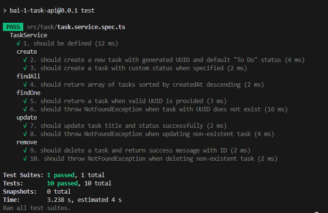

# Bài 1: Nghiên cứu và Triển khai Task API với NestJS

RESTful API quản lý Task được xây dựng với **NestJS**, **MongoDB (Mongoose)**, **Docker Compose**, **Swagger (OpenAPI)** và **Jest**.

---

## 1. NestJS Architecture

### Modules
Đóng vai trò là các khối xây dựng (building blocks) dùng để tổ chức mã nguồn thành các cụm tính năng độc lập, quản lý việc đóng gói (encapsulation), chia sẻ tài nguyên và thiết lập Dependency Injection (DI) trong ứng dụng.

### Controllers
Controllers chịu trách nhiệm định tuyến HTTP requests và gọi các services tương ứng. Validation và transformation dữ liệu đầu vào được xử lý thông qua Pipes kết hợp với DTOs.

### Services / Providers
Chứa toàn bộ logic nghiệp vụ (business logic) và thao tác với cơ sở dữ liệu. Services được tách biệt hoàn toàn khỏi tầng giao tiếp HTTP, giúp dễ bảo trì và viết Unit Test độc lập.

### TypeScript Support
- **Decorators (`@Prop()`, `@Get()`, `@InjectModel()`...)**: Cung cấp cách khai báo metadata thanh lịch, giảm thiểu boilerplate code.
- **Type Safety**: Đảm bảo an toàn kiểu dữ liệu từ DTO, Mongoose Schema đến Service/Controller ngay từ thời điểm biên dịch (Compile-time).
- **Dependency Injection**: Tự động nhận diện và inject dependencies thông qua TypeScript reflection metadata (`reflect-metadata`).

---

## 2. Task Document / Mongoose Schema

| Field | Type | Constraints | Description |
| :--- | :--- | :--- | :--- |
| `id` | `String` (UUID v4) | Unique, Indexed, Required | Unique identifier |
| `title` | `String` | Required, Trimmed | Task title |
| `description` | `String` | Optional, Default: `""` | Detailed description |
| `status` | `Enum` | `"To Do"`, `"In Progress"`, `"Done"` | Task status (Default: `"To Do"`) |
| `createdAt` | `Date` | Default: `Date.now` | Creation timestamp |

---

## 3. RESTful API Endpoints

Global Prefix: `/api/v1`  
Swagger Documentation: `http://localhost:3000/docs`

| Method | Endpoint | Description | Status |
| :---: | :--- | :--- | :---: |
| `POST` | `/api/v1/tasks` | Create a new task | `201 Created` |
| `GET` | `/api/v1/tasks` | Get all tasks (sorted by createdAt descending) | `200 OK` |
| `GET` | `/api/v1/tasks/:id` | Get task by UUID | `200 OK` / `404` |
| `PATCH` | `/api/v1/tasks/:id` | Update task by UUID | `200 OK` / `404` |
| `DELETE` | `/api/v1/tasks/:id` | Delete task by UUID | `200 OK` / `404` |

### Swagger OpenAPI Documentation:


---

## 4. Setup & Running Instructions

### Step 1: Prepare Environment Configuration
```bash
cp .env.example .env
```

### Step 2: Start MongoDB with Docker
```bash
docker compose up -d
```

### Step 3: Install Dependencies & Start Server
```bash
npm install
npm run start:dev
```
- Server: `http://localhost:3000/api/v1`
- Swagger UI: `http://localhost:3000/docs`

---

## 5. Seeder & Performance Benchmark

### 5.1. Database Seeder (100 Sample Tasks)
Chạy script tự động tạo 100 tasks mẫu có index UUID vào MongoDB:
```bash
npm run seed
```

### 5.2. Performance Benchmark
The benchmark uses 100 Task records and sends 100 GET requests to `/api/v1/tasks`:
```bash
npm run benchmark
```

| Metric | Result |
| :--- | :---: |
| Records | 100 |
| Requests | 100 |
| Min latency | 3.80 ms |
| Average latency | 5.13 ms |
| P95 latency | 9.90 ms |
| Max latency | 15.45 ms |
| Requirement | < 200 ms |
| Status | PASS |

### Benchmark Terminal Output:


---

## 6. Automated Unit Tests

Bộ kiểm thử Jest bao phủ đầy đủ **10/10 test cases** cho `TaskService`:

```bash
npm test
```

### Test Suite Summary:
1. `should be defined` — Khởi tạo service thành công với Mock Model.
2. `create - should create a new task with generated UUID and default "To Do" status`
3. `create - should create a task with custom status when specified`
4. `findAll - should return array of tasks sorted by createdAt descending`
5. `findOne - should return a task when valid UUID is provided`
6. `findOne - should throw NotFoundException when task with UUID does not exist`
7. `update - should update task title and status successfully`
8. `update - should throw NotFoundException when updating non-existent task`
9. `remove - should delete a task and return success message with ID`
10. `remove - should throw NotFoundException when deleting non-existent task`

### Unit Test Execution Output:

