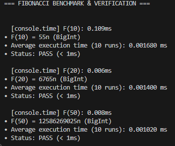

# Bài 2: Tính Số Fibonacci Thứ 50 (F(50))

## 1. Mô tả thuật toán
- **Phương pháp**: Quy hoạch động (Dynamic Programming - Bottom-Up).
- **Cơ chế**: Tính tuần tự từ $F(0) = 0$ và $F(1) = 1$ lên $F(n)$. Mỗi bước chỉ lưu 2 giá trị liền kề trước đó (`prev2`, `prev1`) để tính giá trị tiếp theo.
- **Xử lý số lớn**: Sử dụng kiểu dữ liệu `BigInt` trong JavaScript để đảm bảo tính toán chính xác tuyệt đối, tránh giới hạn tràn số an toàn của `Number`.

## 2. Phân tích độ phức tạp
- **Time Complexity**: $\mathcal{O}(n)$ — Thuật toán thực hiện $n - 1$ phép tính tuần tự để tính $F(n)$.
- **Space Complexity**: $\mathcal{O}(1)$ — Tối ưu bộ nhớ, chỉ sử dụng 3 biến phụ trợ (`prev2`, `prev1`, `current`).

## 3. Kết quả kiểm tra tính đúng đắn
- $F(10) = \mathbf{55}$
- $F(20) = \mathbf{6765}$
- $F(50) = \mathbf{12586269025}$

## 4. Đo lường thời gian thực thi (Benchmark)

**Môi trường thực thi:**
- **Node.js**: `v20.11.0`
- **Hệ điều hành**: `Windows (x64)`
- **CPU**: `Intel(R) Core(TM) i3-10105F CPU @ 3.70GHz`
- **Số lần chạy đo trung bình**: `10 lần`

**Bảng kết quả đo thực tế:**

| Giá trị $n$ | Kết quả $F(n)$ | `console.time` | Thời gian TB (10 lần) | Yêu cầu đề bài (< 1ms) |
| :---: | :--- | :---: | :---: | :---: |
| **$n = 10$** | `55` | $0.109$ ms | $0.001680$ ms | ĐẠT ✅ |
| **$n = 20$** | `6765` | $0.006$ ms | $0.001400$ ms | ĐẠT ✅ |
| **$n = 50$** | `12586269025` | $0.008$ ms | $0.001020$ ms | ĐẠT ✅ |

### Minh chứng chạy thực tế từ Terminal:


## 5. Hướng dẫn chạy
Chạy trực tiếp bằng Node.js:
```bash
node benchmark.js
```
Hoặc:
```bash
npm start
```
