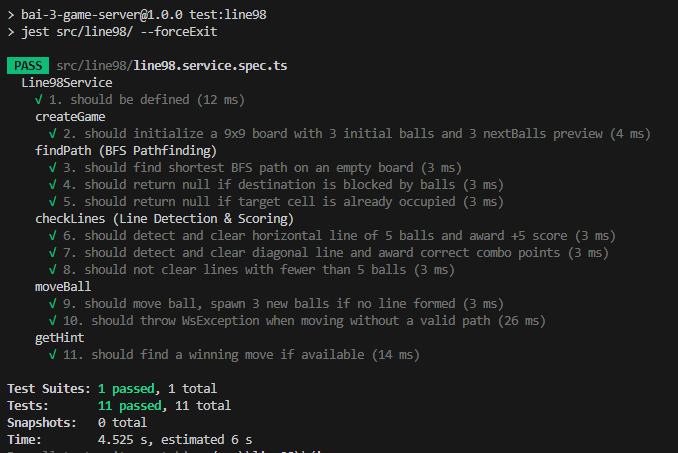
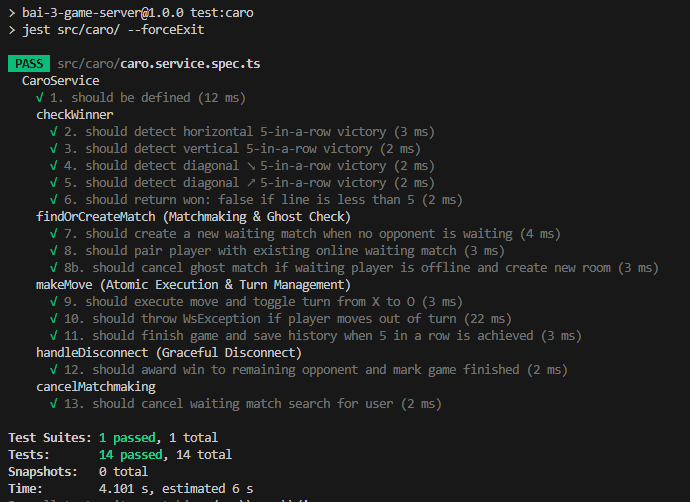
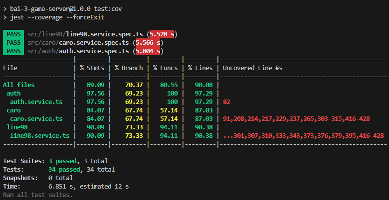
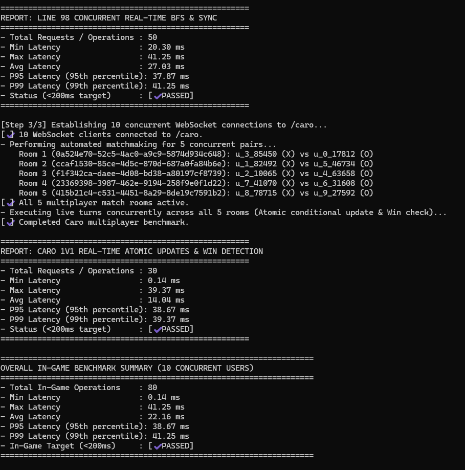

# Game Server — Line 98 & Cờ Caro X O

Hệ thống Game Server thời gian thực xây dựng trên nền tảng **NestJS**, cơ sở dữ liệu **MongoDB**, kết nối thời gian thực **WebSocket (Socket.IO)** và giao diện đồ họa **HTML5 Canvas**.

---

## 1. Giới thiệu Dự án & Tính năng

- **Quản lý tài khoản (Auth Module)**: Đăng ký, đăng nhập (băm mật khẩu `bcrypt`, cấp phát `JWT Token`), cập nhật hồ sơ, bảo vệ kết nối WebSocket qua `WsAuthGuard`.
- **Trò chơi Line 98**:
  - Bàn cờ 9×9, thuật toán tìm đường ngắn nhất **BFS** (tối ưu hóa mảng phẳng 1 chiều tĩnh zero-allocation).
  - Kiểm tra hàng 5 bóng (ngang, dọc, 2 đường chéo), tính điểm combo, tự động sinh 3 bóng ngẫu nhiên kèm preview.
  - Tính năng **Gợi ý nước đi (Hint)** tìm nước đi tối ưu tức thì.
- **Trò chơi Cờ Caro 1v1**:
  - Bàn cờ chuẩn 15×15, tự động ghép cặp người chơi (Matchmaking qua Socket.IO Rooms).
  - Cập nhật nước đi nguyên tử (**MongoDB Atomic Updates**) ngăn chặn race condition.
  - Tự động phát hiện 5 quân liên tiếp và xử lý khi người chơi mất kết nối/thoát trận giữa chừng.

---

## 2. Hướng dẫn Cài đặt & Khởi chạy

### Bước 1: Khởi động Cơ sở dữ liệu MongoDB
```bash
# Sử dụng Docker Compose có sẵn:
docker compose up -d
```

### Bước 2: Cài đặt thư viện & Khởi chạy Server
```bash
# Cài đặt dependencies
npm install

# Khởi chạy server ở chế độ Development:
npm run start:dev

# Hoặc Build và chạy ở chế độ Production:
npm run build
npm run start:prod
```
- **Giao diện Web Game**: `http://localhost:3001`
- **Tài liệu Swagger API**: `http://localhost:3001/docs`

---

## 3. Hướng dẫn Chạy Kiểm thử & Đo Hiệu năng

| Lệnh npm | Chức năng |
| :--- | :--- |
| **`npm test`** | Chạy toàn bộ 34 Unit Tests |
| **`npm run test:line98`** | Chạy riêng 11 Unit Tests của trò chơi Line 98 |
| **`npm run test:caro`** | Chạy riêng 14 Unit Tests của trò chơi Cờ Caro |
| **`npm run test:cov`** | Xuất bảng thống kê độ bao phủ mã nguồn (**Code Coverage**) |
| **`npm run benchmark`** | Kiểm tra hiệu năng 10 người dùng chơi đồng thời trên WebSocket |

---

## 4. Kết quả Kiểm thử & Đo lường Hiệu năng

### 4.1. Unit Test Trò chơi Line 98 (11/11 Tests Passed)
Kiểm thử thuật toán tìm đường BFS, logic ăn hàng 5 bóng, tính điểm và gợi ý nước đi:



---

### 4.2. Unit Test Trò chơi Cờ Caro (14/14 Tests Passed)
Kiểm thử ghép trận (matchmaking), xử lý phòng ma (ghost room), kiểm tra thắng 4 hướng và atomic update:



---

### 4.3. Báo cáo Độ bao phủ mã nguồn (Code Coverage ~90%)
Độ bao phủ tập trung vào 3 tầng Service logic nghiệp vụ chính của hệ thống:



---

### 4.4. Benchmark Độ trễ thời gian thực (10 Users Concurrent < 200ms)
Kết quả đo độ trễ in-game trung bình chỉ **~22.16ms** (Line 98: 27.03ms, Cờ Caro: 14.04ms)


